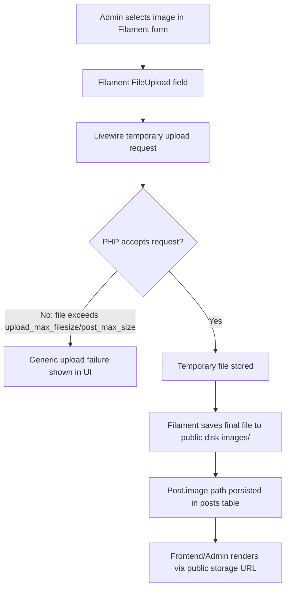
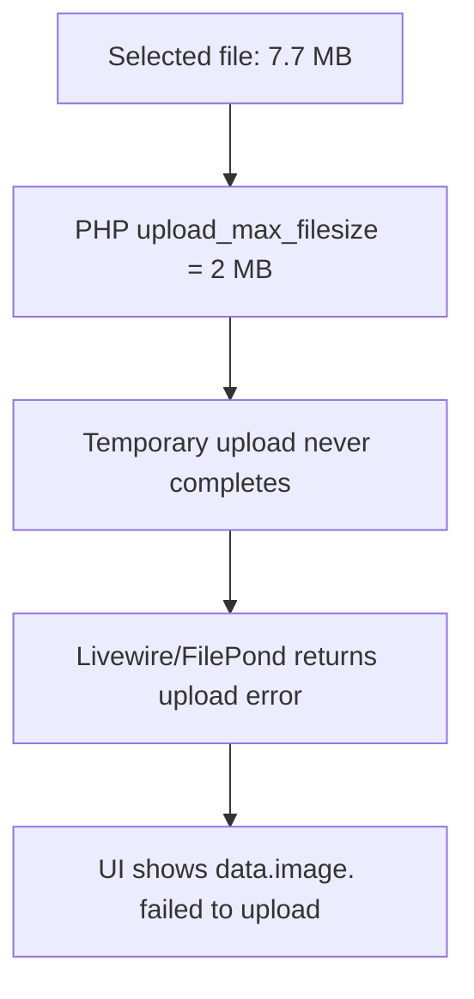
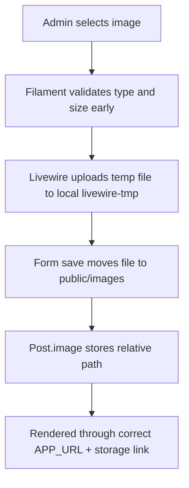

# Admin Post Image Upload

## Purpose
This document explains how post image uploads work in the Filament admin dashboard, why large image uploads were failing on March 2, 2026, and what configuration now governs the flow.

## Symptom Observed
When an admin selected an image in the post form, Filament showed a generic Livewire/FilePond error similar to:

`The data.image.<uuid> failed to upload`

The reported failing example was a `7.7 MB` PNG.

## Root Cause
The primary cause was PHP transport limits, not the `FileUpload` field itself.

Active runtime limits before the fix:
- `upload_max_filesize = 2M`
- `post_max_size = 8M`

Because the selected image was larger than `2 MB`, PHP rejected the upload before Livewire could complete temporary file handling. Filament therefore surfaced a generic upload failure.

Contributing factors:
- No explicit `maxSize()` rule on the image field.
- No application-level `config/livewire.php`.
- No helper text telling admins which file types and sizes were allowed.
- Local `APP_URL` did not match the runtime origin.
- `public/storage` was not a symbolic link/junction at the time of investigation and should point to `storage/app/public`.

## Current Upload Flow
Relevant files:
- [`app/Filament/Resources/Schemas/PostForm.php`](c:/Users/PC/myheat/infinity/infinityapp/app/Filament/Resources/Schemas/PostForm.php)
- [`app/Models/Post.php`](c:/Users/PC/myheat/infinity/infinityapp/app/Models/Post.php)
- [`config/filesystems.php`](c:/Users/PC/myheat/infinity/infinityapp/config/filesystems.php)
- [`config/livewire.php`](c:/Users/PC/myheat/infinity/infinityapp/config/livewire.php)
- [`.env`](c:/Users/PC/myheat/infinity/infinityapp/.env)
- [`routes/web.php`](c:/Users/PC/myheat/infinity/infinityapp/routes/web.php)

1. Admin opens the Filament post form.
2. The image field is defined in [`app/Filament/Resources/Schemas/PostForm.php`](c:/Users/PC/myheat/infinity/infinityapp/app/Filament/Resources/Schemas/PostForm.php) using `FileUpload::make('image')`.
3. Filament uses Livewire temporary uploads first.
4. Livewire writes temporary files to the configured temp disk and directory.
5. On save, Filament stores the final file on the `public` disk in `images/`.
6. The relative path is persisted into the `posts.image` column.
7. Rendering depends on:
   - the `public` disk root `storage/app/public`
   - a working `public/storage` link
   - a correct `APP_URL`

## Failure Path Analysis
The failing image path was:
- browser upload
- Livewire temp endpoint
- PHP transport validation
- generic frontend upload failure

## Storage and URL Dependencies
The final image target is:
- `storage/app/public/images`

Public serving depends on:
- [`config/filesystems.php`](c:/Users/PC/myheat/infinity/infinityapp/config/filesystems.php) `public` disk
- `public/storage` pointing to `storage/app/public`
- [`.env`](c:/Users/PC/myheat/infinity/infinityapp/.env) `APP_URL`

Local runtime should use:
- `APP_URL=http://127.0.0.1:8000`

## Permanent Fix Design
Implemented application changes:
- Added explicit image types: JPG, PNG, WEBP.
- Added `maxSize(8192)` to keep the app rule at `8 MB`.
- Added helper text on the image field for admins.
- Added [`config/livewire.php`](c:/Users/PC/myheat/infinity/infinityapp/config/livewire.php) so temporary uploads use:
  - disk: `local`
  - directory: `livewire-tmp`
  - rules: `required|file|mimes:jpg,jpeg,png,webp|max:8192`
  - max upload time: `10` minutes
- Updated local [`.env`](c:/Users/PC/myheat/infinity/infinityapp/.env) `APP_URL` to `http://127.0.0.1:8000`

Runtime changes required on the machine:
- `upload_max_filesize = 10M`
- `post_max_size = 12M`

## Configuration Requirements
Application rules:
- Supported extensions: `.jpg`, `.jpeg`, `.png`, `.webp`
- Maximum image size: `8 MB`
- Temporary uploads stored privately on the `local` disk
- Final images stored publicly on `public/images`

Server rules:
- `upload_max_filesize` must be greater than or equal to the application image limit
- `post_max_size` must exceed `upload_max_filesize`

Recommended local values:
- `upload_max_filesize = 10M`
- `post_max_size = 12M`

## Validation Rules
Image upload rules are now enforced in two layers:

Filament field:
- image-only upload component
- accepted mime types: `image/jpeg`, `image/png`, `image/webp`
- `maxSize(8192)`

Livewire temp upload:
- `required`
- `file`
- `mimes:jpg,jpeg,png,webp`
- `max:8192`

## Test Scenarios
Run these checks after any environment or deployment change:

1. Upload a valid JPG under `1 MB`.
2. Upload a valid PNG around `7.7 MB`.
3. Upload a valid WEBP just under `8 MB`.
4. Upload an image larger than `8 MB` and verify a clear validation error.
5. Upload a non-image file in the image field and verify rejection.
6. Save a post with an uploaded image and verify:
   - the DB value is a relative path
   - the file exists in `storage/app/public/images`
   - the image renders in admin and public views
7. Refresh and edit the post and confirm the existing image remains visible.
8. Upload an image and an attachment in the same form.
9. Confirm generated URLs work at `http://127.0.0.1:8000`.
10. Confirm temporary files are created under the Livewire temp directory and later cleaned up.

## Troubleshooting Guide
If the UI says `failed to upload` immediately:
- check `upload_max_filesize`
- check `post_max_size`

If the upload succeeds but the image does not render:
- check `APP_URL`
- check `public/storage`
- check the saved DB path

If valid images are rejected:
- compare the Filament `maxSize()` rule with `config/livewire.php`

If uploads work locally but fail in deployment:
- verify the active PHP-FPM, Apache, or Nginx limits
- do not rely only on CLI `php -i`

## Known Non-Root-Cause Issues
- [`routes/web.php`](c:/Users/PC/myheat/infinity/infinityapp/routes/web.php) contains local-only storage/debug routes. They were useful for diagnosis but are not the root cause of the upload failure.
- [`app/Models/Post.php`](c:/Users/PC/myheat/infinity/infinityapp/app/Models/Post.php) does not create this upload failure; it only persists the final relative file path and other post attributes.

## Appendix: File References
- [`app/Filament/Resources/Schemas/PostForm.php`](c:/Users/PC/myheat/infinity/infinityapp/app/Filament/Resources/Schemas/PostForm.php)
- [`app/Models/Post.php`](c:/Users/PC/myheat/infinity/infinityapp/app/Models/Post.php)
- [`config/filesystems.php`](c:/Users/PC/myheat/infinity/infinityapp/config/filesystems.php)
- [`config/livewire.php`](c:/Users/PC/myheat/infinity/infinityapp/config/livewire.php)
- [`.env`](c:/Users/PC/myheat/infinity/infinityapp/.env)
- [`routes/web.php`](c:/Users/PC/myheat/infinity/infinityapp/routes/web.php)
